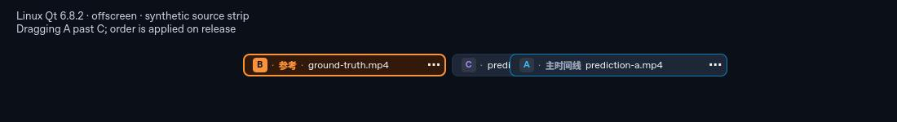
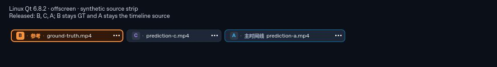

# 来源条真实拖拽排序

基线：`main a0a044066345ed0110f87caab56afb5147f615d5`，2026-10-07。
本项恢复已有来源条的显示排序，不改变 A/B/C 槽位、GT、时间轴源或视频面板顺序。
Windows 原生交互与完整 Main 验收仍待完成。

## 复现

旧 `DragHandler` 设为 `target: null`，但判断位移时读取 `chip.x - pressX`。
`chip.x` 只绑定到固定布局，`dragOffset` 没有接线，所以实际拖动鼠标不会移动来源牌，
也不会在释放时发出排序请求。

真实 Qt 离屏鼠标探针已复现：指针移动约 **601 px**，handler 已 active，来源牌移动
**0 px**，`moveRequested` 为 **0**。原 main 对当前正式测试运行结果为 **22 passed、
4 failed**；既有六个菜单/身份行为场景仍通过，失败来自新的真实拖拽相关场景。

## 修复范围

只修改 `ActiveSourceStrip.qml`：

- 将 `activeTranslation.x` 接到临时显示偏移和释放位置，保持原声明式 `layoutX`。
  正在拖动的牌显示在其他牌上方；释放/取消后偏移归零。
- 只接受无修饰键的左键拖动。普通点击/轻微抖动仍用于选中，右键和 Ctrl 拖动不排序。
- 只在正常 `UngrabExclusive` 终态提交。禁用、隐藏或其他 handler 接管的取消不提交。
- 手势开始时暂存最多三个显示身份，释放时复核；拖中替换、增删或外部重排会取消这次
  排序意图。仍复用现有 `moveRequested` / shell 展示顺序，未另建排序模型。
- 修正既有插入位置到最终索引的换算：向右移动时，移除原元素后目标索引减一。
  否则仅接通 translation 会让向右小拖误移到下一项。无效起始索引/非有限位置被拒绝。

只接 translation 的中间版本在当前测试中 **15 passed、11 failed**，暴露小拖错位、
取消/源变化误提交及层级反馈缺失，因此不能只恢复可移动外观就认为完整修复。

Main、shell、控制器、媒体命令与播放/解码实现均保持原样。本次隔离测试验证显示牌的
sourceId、GT/时间轴身份保持，不把它当作新的播放同步或完整 Main 运行时证明。

## 正式测试与反证

扩展既有 `tests/component/ui/qml/tst_active_source_strip.qml`；使用真实离屏鼠标/键盘：

- 左右拖动、重复拖回、牌仍在自己位置的小拖、2px 抖动仍点击
- 禁用/隐藏取消；另一个真实 PointerHandler 抢占造成的 CancelGrab
- 拖中替换/移除其他源、增源、外部重排，以及替换/移除被拖源
- 源菜单点击不误排序/选中；右键与 Ctrl 拖动不排序
- 释放后回到布局位置，A/B/C、GT和时间轴身份不变

已有六个场景加新十八个场景全部通过；含 init/cleanup，QtTest 报告 **26/26**。
环境：已有 Linux Qt 6.8.2 / Basic / offscreen / software。未安装新依赖，未接入用户屏幕，
未启动浏览器、socket、解码、D3D 或设备服务。

- `QT_SCALE_FACTOR=1 / 1.25 / 1.5 / 2` 四档分别 **26/26**。这是离屏逻辑/事件坐标验证，
  不代表 Windows 显示器切换或真实输入设备已验收。
- **38/38** 成功加载后的实现变异被运行时断言检出；覆盖 **39/39** 新行为断言位置。
- 另有 **3/3** 查找/身份/抢占观测故障，单独验证三个 guard；共 **42/42** 新断言位置。
- 固定变体计数 guard 拒绝故意遗漏一项（42 而非 43 个含正负控制的变体）。
- 直接 Qt 6.8.2 `qmlformat` 检查生产文件无差异，`qmllint` 零警告。

运行时既有原生 Popup.Window 用例会提示 offscreen 插件不支持系统键盘 grab；QtTest 事件
及断言仍通过。该提示不能被解读成 Windows 原生菜单焦点已验证。

## 实际离屏截图

以下是真实组件渲染、合成三源列表；图上的 Linux/synthetic/阶段说明仅存在于截图探针，
没有加入生产界面。截图不是 Windows 主窗或真实视频素材。





## 未验与 Windows 入口

未执行 Windows/MSVC、固定 Qt 6.11.1、Windows 控件风格/真实鼠标与多显示器DPI、完整
Main/shell集成、实际视频播放、完整 build/CTest、仓库 format-check/lint、GPU/性能或ZIP。
原生复核还应在实际视频会话里比较拖动前后的 GT、时间轴与当前帧是否保持。

```powershell
pwsh tools/build/build.ps1 -Preset dev -Test -TestRegex '^ui[.]active_source_strip'
pwsh tools/build/build.ps1 -Preset dev -Test -TestRegex '^ui[.]MainQmlContractTests[.]StripChipsFollowDisplayOrderWithoutChangingTheirSourceId$'
pwsh tools/build/build.ps1 -Preset dev -Target format-check
pwsh tools/build/build.ps1 -Preset dev -Target lint
```

正式用例只在仓库测试文件维护；本轮探针、变异副本、映射与日志在
`out/verification/source-drag/`。保持 Draft，不宣称播放性能改善或原生Windows交付验收。
