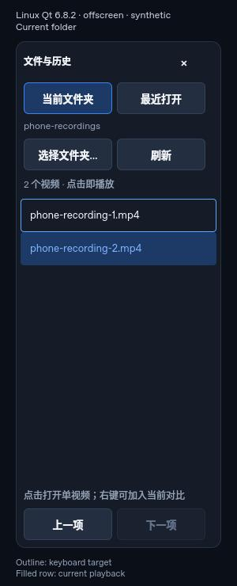
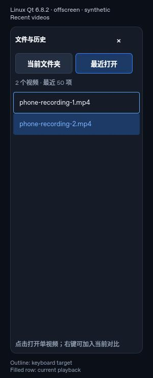

# 视频文件夹浏览与手动播放

2026-10-02，基线 `4a67d1b` + 未提交工作区。此页记录日常播放入口，不是媒体库、批量评测
或发布验收；此前指标与打包工作区均保留。

## 2026-10-07 Windows 原生集成复核

基线 PR #37 `14ccbbc3`，菜单修复 `7dc59e9`，与本地 main `84105f9` 合并为 `3f88d8e`。
以下是集成前定向结果，最终带 2.2.0 版本的全量与发布记录另存于
`out/verification/pr37-release-20261007/`。

- MSVC v143、Qt 6.11.1：首次完整 Debug 回归发现三项主窗测试与两组侧栏测试失败。
  历史数组重排替换行后，原 `popup(item, point)` 依附被销毁的行；改用侧栏作为稳定父项，
  保留坐标映射与冻结 URL。原故障用例在 Basic、Windows 两种样式均复现，修复后均通过。
- 普通成功打开会恢复 continuity／pair／range 偏好，原新增测试错误要求仅一个总命令；
  改为明确断言一次打开、零隐式 Play。切换到历史列表后显式执行 Qt ListView forceLayout，
  比较确认的 Escape 测试激活真实窗口并等待启动布局。未取消测试或放宽生产门禁。
- 只读复核发现侧栏菜单初开且 currentIndex=-1 时，全局快捷键可漏到主窗。完整 Main 回归
  在旧门控下成功构建后由运行时断言检出（inputContext=0，出现媒体命令与打开窗口），
  加入侧栏 anyMenuOpen 后通过，并验证菜单关闭后 Space 恢复正常播放。
- 四项完整 Main 契约加侧栏 Basic／Windows 共 6/6 通过；固定 clang-format 19.1.5
  的仓库格式检查通过。完整 lint 与最终 main 的全量回归、硬件／性能、ZIP 独立记录，
  此处定向证据不代替发布验收。

## 2026-10-07 侧栏右键打开与加入对比（原 PR 验证记录）

基于已发布 Draft #37 的侧栏提交 `6923ff1229655e2f28880ad16c037c65e1cf838a` 独立增补：

- 「当前文件夹」和「最近打开」共用右键菜单，提供「打开为新单视频任务」与
  「加入当前视频对比…」。前者明确替换为一个视频；后者只允许在当前 1–2 源视频任务中
  追加，不会在零源／满三源时回退为替换。不可用项禁用并显示原因。
- 右键仅打开菜单；Menu 键和 Shift+F10 可唤出，方向键／Enter 可选择，Escape 取消。
  菜单冻结文件 URL，历史重排或列表选中行改变不能将动作指向另一文件。
- 追加复用原顺序／参考源确认窗口，初始 GT 是当前真实参考源，而不是时间线主源。
  用户仍可明确改顺序或参考源。取消或按 Escape 不提交源命令；普通拖入／添加入口的
  原有默认行为不改。已有源、参考身份和观察时刻沿原 shell 的追加／重开流程保留。
- `ReviewShellController::stageSidebarAppend/openSidebarAppend` 独立持有追加快照：已提交
  媒体身份、当前参考、成功源 intent 代次、候选路径／磁盘身份。确认和实际出队提交均复核；
  新会话、参考变化、原文件／候选被替换或删除后拒绝，不把旧追加重基到另一个比较组。
  同路径重新打开也使旧确认失效。重复接受和被普通打开覆盖的旧窗口不能重新提交。
- 磁盘检查复用当前 `SourceIdentity` 的规范路径、大小和修改时间，不在 GUI 线程读取整段
  视频或计算哈希；不能声称可检出刻意保留大小／时间戳的内容篡改。解码失败仍由原事务
  打开链路保留已提交源；追加不自动播放、不写单视频历史。

本次验证与边界：

- Linux/GCC14 + Qt6.8.2：真实模型／偏好 **32/32**，真实 controller/shell **69/69**。
  shell 验证仍只在副本中给既有三处平台整数差异加 `qlonglong` 转型；生产 controller 未改。
- 实际 QtQuick Basic/offscreen 侧栏 **11 项行为场景**（含 init/cleanup 为 **13/13**），
  包括两页右键、键盘选择／取消、禁止串到左键打开、冻结 URL、缺失／满源禁用原因和旧菜单关闭。
- 独立探针直接提取本候选 Main 函数及 `ReviewInputDialogs` 接线，在真实 Qt Popup 中验证
  接受、Escape 取消和既有拖入行为。不是完整 Main 主窗验收。
- 新增完整 Main 契约 `SidebarComparisonEscapeAndAcceptPreserveCurrentReference` 已通过
  warning-fatal 语法编译，尚未链接运行。两处 QML 组件的直接 qmllint 无警告；完整仓库
  format-check/lint、Windows/MSVC、固定 Qt6.11.1、完整 CTest、真实素材／D3D11 和 ZIP 门禁未跑。
- 行为变异证据放在 `out/verification/context-menu/`，独立复核另行保存真实编译／运行日志。
  编译或 QML 加载失败不计作变异检出；本轮最终数量随独立回执记录。

## 2026-10-07 文件与历史侧栏增补（待 Windows 原生验收）

基线 main `39be3a62760415b5eae751c1e4266eed8e91e713`，包含用户合入的坏点占比行修复。
直接复用既有 `VideoFolderModel`／`VideoFolderSidebar`，没有另建播放器或目录扫描链路。

- 普通文件菜单／Explorer 成功打开单视频后自动显示侧栏；「当前文件夹」跟随已提交视频的
  父目录，只枚举顶层五种既有视频扩展，保留自然排序与当前文件高亮。手动浏览另一目录后，
  重复状态投影不会抢走选择；成功重新打开文件才回到它的父目录。
- 「最近打开」最多保存 50 个成功单视频打开的 URL，新到旧排序、去重并保留完整路径提示。
  复用 `ReviewPreferencesController` 的异步设置仓库、去抖保存与事务写盘；快速打开先于
  设置加载时合并旧历史，不触发全局 `localChanges_`，避免覆盖原来的视图／快捷键偏好。
  在途旧保存完成也不会丢掉更新的历史。历史不保存帧位置或比较会话。
- 历史项也经过原 `ReviewShellController::openVideo`，匹配成功终态及当前 URL 后才自动播放。
  删除／移动后的旧路径仍保留，失败时沿用原画面与历史，不自动清理或改指向其他文件。
  非本地路径、图片、失败尝试和多源比较不会写入历史；浏览／扫描不改变 GT 或候选。
- 点击仍进入新的单视频任务；右键增补后提示为「点击打开单视频；右键可加入当前对比」。
  收起和纯净模式沿用既有空间归还规则；
  窄高区域采用紧凑布局，文件名省略但完整路径可悬停查看。
- 自动跟随只调扫描，不取消较新的排队 intent。A→B→A 快速切换会抑制 B 的旧目录回复；
  扫描完成也不能抹去最近打开失败的错误。新接受的普通打开清除旧浏览错误，但不抹去
  匹配浏览器打开后真正的播放拒绝信息。
- 范围仍为本地视频：不新增图片历史、递归扫描、目录监视、自动连播、清空历史或会话恢复。
  旧问题记录的直接 controller 恢复路径没有迁移；它的源投影可跟随目录，但不会新增历史。

验证与限制（不能转述为完整 Windows 验收）：

- Linux/GCC14 + Qt6.8.2 Core 真实编译执行 `VideoFolderModelTests` 22 项、
  `ReviewPreferencesControllerTests` 8 项；新增 10 项覆盖自动跟随、陈旧扫描、历史去重／
  容量／失败、重新打开、本地范围以及异步设置加载／保存重叠。
- 生产 `ReviewController`／shell 接线在 Linux 验证副本上执行；副本仅给既有三处
  Windows/Linux `long`→`QVariant` 差异显式加 `qlonglong` 转型，不修改仓库生产代码。
  共 57 项通过，含新增的成功历史／失败和比较排除／历史提交后播放／旧错误清理回归。
- 实际 QtQuick Basic/offscreen 侧栏组件测试 4 项行为场景（另有 init/cleanup），覆盖两页
  点击、重复切页、当前高亮、键盘、扫描期间历史操作以及 320px 高度含错误的可点击列表。
  独立截图是隔离组件与合成列表，**不是 Windows 完整播放器或真实解码画面**。
- 新增 2 项 `MainQmlContractTests` 保留完整主窗入口／工作区／普通打开与非默认 GT 比较
  接线验证，但本环境未执行。Windows/MSVC、固定 Qt6.11.1、完整 build/CTest、仓库的
  format-check/lint、真实素材／D3D11 性能与 ZIP 打包门禁均未运行。
- 行为变异在 `out/verification/file-sidebar/` 保留编译、运行和计数；14 项模型／偏好变异及
  7 项 QtQuick 变异由运行时断言检出；独立真实 shell 接线另有 2 项编译成功后的
  运行时变异检出（丢失成功历史接线、旧错误残留）。编译失败不计作检出，生产源不修改。
  独立接线／截图证据位于 `out/verification/sidebar-independent/`。

Windows 定向复核入口：

```powershell
pwsh tools/build/build.ps1 -Preset dev -Test -TestRegex 'ui\.(VideoFolderModelTests|ReviewPreferencesControllerTests|ReviewControllerTests|MainQmlContractTests|video_file_sidebar)'
pwsh tools/build/build.ps1 -Preset dev -Target format-check
pwsh tools/build/build.ps1 -Preset dev -Target lint
```

## 用户可见行为

- 首屏「从文件夹选视频…」、文件菜单同名入口、`Ctrl+Alt+O` 打开文件夹选择器。
- 只列所选本地文件夹顶层的 `.mp4/.mkv/.mov/.avi/.m4v`，大小写不敏感，文件名自然排序
  （`clip1 / clip2 / clip10`），保留中文路径。文件名过滤不是可解码格式认证。
- 点击文件以**新的单视频任务**打开，等待生产 shell 的匹配成功终态，再开始静音播放。
  已有视频播放中则先异步暂停并等待传输／旧帧收尾，再打开；不要求用户手动暂停。
  Open 的成功仍以首帧呈现 ACK 为前提，没有绕过播放内核或伪造终态。
- 上一项／下一项为手动操作，不越过端点、不在 EOF 自动连播。快速换选以最新待打开项为导航
  锚点；当前高亮只跟随实际已提交的单视频源，失败不把画面错误标成所点击文件。
- 选择文件夹本身不打开视频或切换工作区。列表可收起、通过视图菜单重新显示；纯净模式隐藏
  列表并归还画面空间。图片画面也可保留到新视频成功，而不是选择目录后立即丢掉。
- 刷新保留播放内容，按 URL 重新寻找当前文件，不用旧行号认领移动后的列表项。空目录、目录
  读取失败、视频打开失败分别显示状态；失败保留上一份完整目录和已提交的媒体任务。

不做递归扫描、缩略图／媒体探测、媒体库、目录监视、会话持久化、音频和字幕。显式 UNC／
网络 URL 被拒绝；映射盘的系统调用仍可能慢，不承诺读取耗时。关闭／换目录抑制旧自动播放，
并取消仍排队的旧 intent；**已经交给内核的活动 Open 不被强行终止**，可完成为暂停的视频。

## 实现边界

- `VideoFolderModel` 是 Qt Core 列表投影：worker 仅持有不可变目录参数、代次、取消 token 和
  独立 mailbox，绝不持有 QObject。文件枚举、可读性检查和排序都在 worker 运行。
- 默认每个浏览器最多一个 worker、一个 latest queued job；不在 GUI 上 join 慢文件系统调用。
  结果一次性 reset，代次／取消 fence 拒绝旧回复；每份目录硬限 100,000 个视频，超限报错而非
  发布截断列表。20 ms 轮询仅在读取期间活动，不是逐帧媒体工作。
- `ReviewShellController::openVideo` 冻结单个 URL、参考槽 0 和 NewReview 意图，返回独立 intent
  身份，继续使用现有有界串行队列和 foreground command 终态。浏览器不改写 staged 比较列表。
- `attachPlayback` 共用于桌面组合根和集成测试：源集同步决定当前行；匹配成功、当前 URL 仍为
  目标、且 play 被接受，才能自动播放。外国终态、重复终态、失败重开同一文件都不能误播放。
  更新的普通文件菜单／Explorer／素材 intent 也会使旧浏览器自动播放失效。
- `VideoFolderSidebar.qml` 懒加载，与原视频／图片视口保持空间分离；选择器加入原 modal gate。
  原有 FrameSet、generation/request 身份、呈现 ACK、精确定位与比较指标没有改动。

## 播放中换项提交失败修复

用户反馈选中 `videos` 目录后出现「无法提交视频打开请求」。已复现其中一个确定原因：
`ReviewController::busy()` 仅表示前台命令，播放中、Play/Pause 在途及旧播放帧收尾时可以为 false，
但 `canOpen()` 仍为 false。原 shell 仅按 busy 判断提交／出队，立即拒绝 Open，浏览器得到 intent
ID 0 后显示该错误；这不是目录枚举失败或扩展名过滤问题。

修复在 `ReviewShellController::submitOrQueue/drainIntentQueue`：

- graphics 已就绪而 canOpen 未就绪的素材 intent 保留在原有有界队列，异步唤醒 drain。
- 仅在 canPause 为 true 时提交一次 Pause；既有 Play/Pause 在途则等待其匹配终态。即使
  requested==displayed，也必须等 requested frame 清空，不能用 framePending 代替 canOpen。
- 旧帧收尾后的 stateChanged 恢复出队；成功 Open 后才沿既有浏览器接线自动播放。快速换选／
  取消仍操作排队 intent，当前高亮仍来自实际提交源；Close 的优先级与前台串行门禁不变。
- Pause 提交被拒绝则结束该排队项并报告失败，不残留永久等待；graphics 未就绪仍拒绝 Open。
  没有循环等待、GUI join、放宽内核命令门禁或修改 ACK-before-commit。

`ReviewControllerTests` 新增 **6 项**，通过生产 `attachPlayback` 与 shell 覆盖上述路径、外国
transport terminal、最新选项、取消、Pause 提交拒绝及 graphics 未就绪。修复前 **5/6 失败**，
修复后相关 controller/model/Main 定向 **113 实际通过＋4 原有 disabled**。新增反例 **10/10**
均成功构建后由运行时 GoogleTest 断言检出；9≠10 缺项 guard 拒绝执行，源字节恢复并回读。

首轮全量再次发现旧 `ImageWorkspaceManual` 的等待假设：窗口 shown，但 RowLayout 的 polish
仍 scheduled，未收到新渲染帧；`waitForPolish`／`waitForRendering` 会超时。这不是本次 shell
产品修改导致的布局变化。测试现在让 text/layout 更新进入事件循环，再有界查询原两条几何
条件，不要求 polish 队列完全空闲；未改变产品布局或宽度上限。强制像素读数越界、状态栏覆盖
提示区的 **2/2 QtTest 产品变异**仍被原几何条件检出，产品源逐字节恢复。

恢复重建后的默认 dev：**859 项：852 实际通过、3 原有 skipped、4 原有 disabled、0 failed**；
完整 lint、format-check 通过。日志、变异脚本与结果、两轮全量、布局复查／探针及源码前置
备份在 `out/verification/video-folder-open-transport/`，不覆盖首批证据。当前测试注入快照／
终态，不是实际用户 `videos` 素材、屏幕 ACK 或硬件长测验收；仍需用户重试确认该具体目录。

## 首批回归、反例与画面

生产测试只在 `tests/component/ui/`：

- `VideoFolderModelTests` **15 项**：异步提交、扩展名／自然排序／中文及未知 Unicode 后缀、
  非递归、旧回复、取消／清空、非法目录、刷新重定位、终态／URL、失败重开、快速选择、
  导航端点、容量、调度与播放拒绝、实际后台 worker 和 owner 销毁后的闭包。
- `MainQmlContractTests` 新增 **4 项**：真实菜单／modal gate、实际 ListView delegate 点击→
  单源 NewReview→匹配终态→Play、失败保留工作区与源集、外国新 intent 抑制旧自动播放。
  集成测试使用生产 UI/controller/shell 接线，但媒体快照／终态由测试注入，**不是实际解码或
  屏幕呈现 ACK 的新性能证据**。
- 新增 **19/19** 控制组通过；**40/40** 故障变异在成功构建后由运行时 GoogleTest 断言检出。
  变异脚本要求唯一锚点和固定 40 项、逐项写入回读、finally 逐字节恢复、JSON 读回；故意少一项
  的 39≠40 guard 已拒绝执行。首次 unused-parameter 编译失败不计为检出，修正变异后重新执行。
- 完整 C++／QML lint 通过，最后 QML 再检与 format-check 通过。恢复重建后默认 dev 选中
  **853 项：846 实际通过、3 原有 skipped、4 原有 disabled、0 failed**（CTest 的 849 包含
  skipped，不写成 849 项实际通过）。
- 全量暴露既有图片测试的检查时序：长读数在 RowLayout polish 前 941 px＞可用 920 px，
  polish 后 762 px。`ImageWorkspace.qml` 与 HEAD 相同；首批在原两条宽度断言前增加
  `verify(waitForPolish(details))`，不改产品布局或放宽宽度条件。删掉等待的 QtTest 变异 **1/1**
  被原宽度断言检出，源字节恢复。首轮失败／两次复查／探针／最终全量分别保留。

证据：`out/verification/video-folder-browser/` 的 `red.log`、`control-before-mutation.log`、
`folder-tests.log`、`mutation-run.log`、`mutation-resume.log`、`mutation-results.json`、
各变异 build/test 日志、质量日志、`full-dev-final.log`、`pixel-layout-probe.txt`、
`layout-wait-mutation.txt` 和 `before/`。`folder-sidebar.png` 是测试窗口实际 Qt 截图，
展示目录列表／高亮／导航／空间分隔；画面是注入会话的空渲染面，不冒充真实素材画质截图。

```powershell
pwsh tools/build/build.ps1 -Preset dev -Test -TestRegex 'ui\.(VideoFolderModelTests|MainQmlContractTests)'
pwsh tools/build/build.ps1 -Preset dev -Target format-check
pwsh tools/build/build.ps1 -Preset dev -Target lint
```

未提交、未发布。真实用户目录／素材、五分钟 D3D11VA／UI 响应／解码缓存、覆盖率和 ZIP
发布门禁仍须绑定后续候选验证，开发回归不替代这些门禁。


## 2026-10-07 键盘目标与播放项分开显示（待 Windows 原生验收）

基线为 `main a0a044066345ed0110f87caab56afb5147f615d5`，独立于视频倍率修复。

### 复现与交互

「当前文件夹 / 最近打开」原来只给当前播放项填色。上下键改变 `ListView.currentIndex`
后，Enter 会打开新目标，但目标没有对应的可见标识；当 Tab 焦点直接落在某个委托行时，
键盘菜单还可能继续使用列表里旧的 currentIndex，作用到另一文件。

本次只在 `VideoFolderSidebar.qml` 为两页加上同样的小修：

- 当前播放项继续使用原来的填色；列表有键盘焦点时，当前键盘目标另外显示细边框。
- 委托行取得焦点时同步当前索引，确保该行与 Enter、Menu / Shift+F10 指向同一文件。
- 上下键选中本身不打开文件；焦点离开列表后边框消失，选中索引保留。
- 原单击播放、右键确认、当前项填色、历史保存、扫描与失败处理保持；不改 shell、模型、
  文件 IO、播放内核或快捷键分配。

### 真实离屏截图

以下来自实际 Qt 6.8.2 / Basic / software 的隔离组件，使用合成文件列表。
边框是键盘目标（第一个文件），填色是当前播放项（第二个文件）。图顶的 Linux/synthetic
标签和底部图例只存在于截图探针，未加入生产界面；图片已检查且最终源码复拍字节一致。
这不是 Windows 主窗或真实视频播放验收。





JPEG 合计约 39 KB，遵循现有二进制属性；没有改写 PNG/ICO/ZIP 的 LFS 规则。

### 本轮验证

- 正式 `tst_video_file_sidebar.qml` 新增三种场景、两页各跑一次：上下键目标/Enter、
  委托焦点/键盘菜单/Escape、失焦保留选择。真实离屏窗口接收键盘事件。
- 原正式套件 11 个行为场景 + 新 6 个场景均通过；加 init/cleanup，QtTest 报告
  **19 passed、0 failed**。原 main 保留原 11 个行为场景通过，但新 **6/6 失败**。
- **21/21** 成功加载后的实现变异被新场景运行时断言检出；**20/20 行为断言位置**
  均有失败证据。另 **5/5 观测故障**验证委托查找/焦点检查，独立计数，不算实现变异。
  固定变异数量 guard 拒绝故意遗漏一项（27 而非 28 个含正/负控制的变体）。
- 实际截图的两个场景通过，含 init/cleanup 报告 4/4；最终源码复拍逐字节一致。
- 直接 Qt 6.8.2 `qmlformat` 检查生产文件无差异，直接 `qmllint` 零警告。
- 所有运行使用已有云端依赖、offscreen/software 与合成模型；没有连接用户屏幕，
  没有 D3D、解码、播放器、浏览器、socket 或设备服务，也没有安装新依赖。

正式用例仍只在原仓库测试文件维护；变异副本、截图探针、日志和映射位于本轮
`out/verification/keyboard/`。它们不替代 Windows CTest。

### 尚未验证

Windows/MSVC、固定 Qt 6.11.1、Windows 控件风格、原生键盘焦点及真实主窗、真实文件打开、
完整 build/CTest、仓库 format-check/lint、播放/GPU 性能与 ZIP 未执行。

```powershell
pwsh tools/build/build.ps1 -Preset dev -Test -TestRegex '^ui[.]video_file_sidebar[.]'
pwsh tools/build/build.ps1 -Preset dev -Target format-check
pwsh tools/build/build.ps1 -Preset dev -Target lint
```

人工复核：打开目录并播放第二项，按上下键把目标移到第一项，检查边框/播放填色；
Enter 应打开边框对应文件。切到最近打开重复，再用 Tab / Shift+Tab 进入列表行，
用 Menu / Shift+F10 打开菜单及 Escape 取消，确认目标一致且取消不打开文件。
本项保持 Draft；不把组件通过宣称为 Windows 实际体验或播放流畅度验收。
