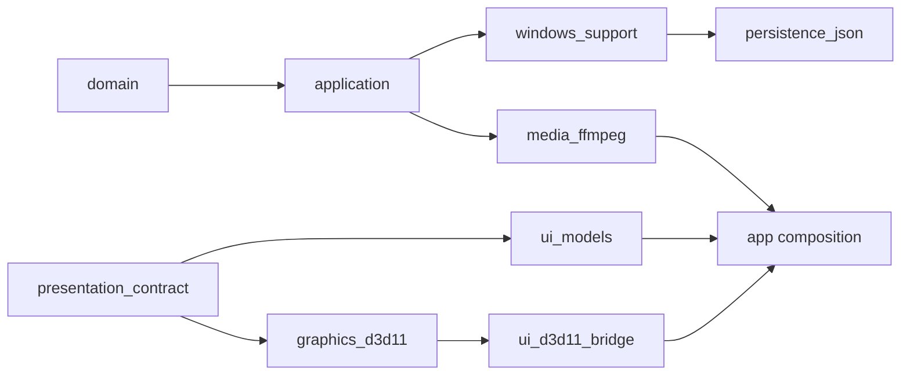

# 01｜现状架构与证据审计

## 结论

Toy 当前不是“普通 Qt 播放器原型”，而是一套已经形成专业约束的多源视频评审系统。它最有价值的资产是：**完整 FrameSet 原子提交、ACK 驱动的显示真相、严格异步身份、FFmpeg 解码与 D3D11 呈现隔离、VFR 时间线，以及测试/硬件门禁意识。**

整改必须采用“保留内核、收紧语义、渐进抽取”的方式。当前问题主要集中在 Application/UI 状态所有权和会话语义，而不是 FFmpeg 能否解码或 D3D11 能否绘制。

## 1. 审查基线

| 项目 | 结论 |
|---|---|
| 仓库 | `sonwe1e/Toy` |
| 默认分支 | `main` |
| 审查 HEAD | `d04339c66956c4aca26a2d6d8d3e680229ea5aad` |
| 最新代码发布 | `dd21a4cb4c2bfa35c912c925c3b9397c2d58dddd`，VCStation 1.6.0 |
| 主技术栈 | C++20、Qt Quick/QML、FFmpeg、D3D11、Windows x64 |
| 当前产品范围 | 1–3 路本地视频、无音频、帧准确播放与比较 |
| 当前主要格式 | H.264、HEVC、MPEG-4 Part 2；SDR；软件与 D3D11VA |
| 当前主要模式 | Single、Side-by-side、Three-up、Reference-focus、Wipe、Difference、Analysis-grid |
| CI | Windows Debug/Release、Linux Core、format/lint、D3D11/GPU pixel、性能、安装/发布门禁 |
| 本次限制 | 未在目标 Windows/GPU 环境构建或执行硬件测试 |

## 2. 当前分层与数据流

当前仓库已经建立较清晰的依赖方向：



仓库中的 `docs/architecture/dependency-rules.md` 明确规定：

- Domain/Application 不接触 Qt、FFmpeg、JSON、Win32、D3D11；
- `presentation_contract` 是比较枚举与展示能力的纯 C++ 边界；
- UI model 不依赖 D3D11；
- composition root 是唯一允许构造具体 adapter 的位置；
- `core-dev`、`ui-dev`、`dev`、`release` 从构建层验证依赖边界。

这是正确基础，应保留并继续强化。

### 2.1 打开会话

```text
QML/Open Dialog/Drop
  → ReviewShellController 形成 ReviewIntent
  → ReviewController 提交 Open/Replace/Reference change command
  → PlaybackCoordinator 串行处理
  → MediaProbe 并行探测每个 Source
  → ComparisonValidator 验证并建立 canonical source
  → MultiSourceFrameProvider 打开 per-source decode actor
  → 请求 canonical frame 0 或保留的 MediaTime
  → FrameSet 完整组装
  → RenderChannel 发布
  → D3D11 renderer 绘制
  → Presentation ACK
  → SessionSnapshot.displayedFrame 提交
```

### 2.2 正常播放

```text
PlayCommand
  → PlaybackRun
  → canonical timeline + wall-clock anchor
  → current frame + prepared successor
  → MultiSourceFrameProvider Sequential
  → per-source decode actor 并行
  → FrameSetAssembler
  → GPU transfer / mailbox
  → D3D11 render
  → ACK 后移动 displayedFrame
```

### 2.3 精确导航

```text
Seek/First/Last/非 +1 Step
  → 新 playback generation
  → Exact request
  → FFmpeg seek/flush/decode
  → 完整 FrameSet
  → ACK 后提交
```

### 2.4 连续前向逐帧

v1.6.0 已引入 `InteractiveStepRun`：

```text
连续 StepFrames(+1)
  → 单一 generation
  → Sequential request
  → 1 current + 1 prepared
  → bounded input lookahead = 3
  → 每帧仍要求 FrameSetReady + RequestSucceeded + Presentation ACK
```

这是很好的工作负载专项优化，但目前只覆盖 `+1`。

## 3. 值得保留的工程资产

### 3.1 FrameSet 原子性

`AGENTS.md`、`docs/architecture.md`、`PlaybackCoordinator`、`FrameSetAssembler` 和硬件测试都围绕同一原则：

> 不允许单路帧先提交；一次可见更新必须是完整 canonical FrameSet。

这是多源视频评审系统和普通播放器最大的结构差异。任何第三方播放器内核替换都必须首先证明能保留此语义，否则不能作为可行方案。

### 3.2 ACK 才是显示真相

当前 `displayedFrame` 不是“已解码”或“已发往渲染器”的帧，而是 renderer 已确认呈现的帧。这个模型使：

- UI 时间码与屏幕实际像素一致；
- 失败时可以保留最后一帧；
- 不会因 provider 先完成而提前移动播放头；
- 性能指标可以测量真正的用户可见延迟。

后续的 Reverse Step、Scrub、Range Loop、Blink、Metric 都必须继续以 ACK 作为提交边界。

### 3.3 异步身份与取消

当前代码已使用：

- `sessionId`
- `sessionEpoch`
- `playbackGeneration`
- `deviceGeneration`
- `requestId`
- 具体 frame/request context

并对取消与失败做了区分。v1.6.0 将交互逐帧的“正常导航取代”和“媒体/渲染失败”拆开，避免把用户操作显示为错误。这是成熟设计，应扩展到 thumbnail、metric、audio，而不是另建无身份的后台回调。

### 3.4 有界队列与缓存

当前可见配置包括：

- Exact request slot：1
- Sequential request slot：2
- Prefetch request slot：8
- Interactive input lookahead：3
- FrameSet cache：96 MiB
- 每源 cache：12 MiB
- Timeline marker 可见上限：256
- shell intent queue 上限：8

这些界限体现了正确理念：不通过无限排队换取“看起来不卡”。未来增加反向窗口、缩略图和指标缓存时，应统一进入中央预算，而不是每个模块各自加大容量。

### 3.5 兼容性与精确性分级

`ComparisonExactness.cpp` 已把比较结果区分为：

- Exact code value
- Display-space converted
- Spatially resampled
- Temporally aligned
- Unavailable

当前 UI 也会显示“Pixel-exact / Display-space converted / Spatially resampled / Temporally aligned”。这是构建专业质量指标的好起点，应提升为完整 `ComparisonProvenance`，而不是删除或简化。

### 3.6 硬件与发布门禁

现有流水线覆盖：

- Debug/Release 全量测试；
- Linux Clang core；
- format 与 clang-tidy；
- D3D11VA、zero-copy、真实 Wipe/Diff pixel capture；
- 1080p60/120、1/2/3 source 性能配置；
- mode switch retained frame；
- 旋转/填充 Wipe；
- packaged smoke、shutdown soak、资源退休；
- MSI 升级。

目标计划应在此基础上补矩阵和基线趋势，不应另起一套测试体系。

## 4. 当前集中点与技术债

下列文件体量和职责非常集中：

| 文件 | 现状职责 | 风险 |
|---|---|---|
| `src/application/src/PlaybackCoordinator.cpp` | 会话、探测、打开、导航、播放、逐帧、对齐、ACK、设备与关闭 | 状态组合增长；修改任一工作流容易影响其他终态 |
| `src/ui_qml/src/ReviewController.cpp` | 几乎全部 UI 状态投影、命令提交、时间码、错误、对齐、Source 信息 | 高频帧更新与低频会话状态共用投影；可测试但难演进 |
| `src/ui_qml/src/ReviewShellController.cpp` | Source intent、拓扑重建、Reference、比较解析、Range、Chrome/Inspector | 会话、展示和播放范围混合 |
| `src/ui_qml/qml/Main.qml` | 布局、状态派生、错误文本、范围循环、输入上下文、比较配置、HUD | QML 已承担应用状态机；组合场景回归概率高 |
| `src/platform_windows/src/D3d11ComparisonRenderer.cpp` | 布局、颜色转换、Wipe/Diff、所有绘制资源 | 新模式继续加入会膨胀；需要 pass 化但不应重写 |
| `tests/unit/application/PlaybackCoordinatorTests.cpp` | 大量协调器行为集中测试 | 测试很强，但也反映一个类承载太多行为 |

仓库自己的 `docs/architecture/state-ownership.md` 和 `ReviewSessionFacade.h` 已明确承认目标是窄 capability model，目前 façade 仍把 playback/alignment/notifications 指回同一个 `ReviewController`。因此，拆分并非外部偏好，而是现有架构尚未完成的迁移。

## 5. 版本历史反映的根因模式

近期版本修复集中于以下边界：

1. **比较 Pair 与 Source Count**
   - 持久化 A/C 或 B/C，在两路会话中曾导致 Wipe/Diff 黑屏；
   - 后续通过 effective pair normalization 修复；
   - 根因仍是“会话身份状态用全局 ordinal preference 表达”。

2. **渲染 ACK 与失败**
   - 修复失败帧被 ACK 成黑帧、模式切换保留帧、Wipe 旋转/UV/letterbox；
   - 说明渲染与提交边界是高风险区，新增模式必须走同一几何/ACK 契约。

3. **输入与焦点**
   - 修复菜单关闭抢焦点、快捷键在不同 preset 下行为不一致；
   - 说明自定义控件和 ApplicationShortcut 的组合必须有系统测试。

4. **播放调度**
   - catch-up tolerance 从短窗口扩到 2 秒，以避免受限 runner 上误丢帧；
   - 连续前向逐帧从 Exact cancellation storm 改成 Sequential stream；
   - 说明“播放”“逐帧”“随机 seek”必须建模为不同工作负载。

5. **UI 布局**
   - 单源全画布、多源 docked transport、自适应 inspector/DPI；
   - 说明产品方向已是单源 player-first、多源 review-first，而不是一个固定布局。

这些历史不是否定当前质量，而是说明下一阶段不能继续依靠局部条件分支。需要让概念和所有权在类型层可见。

## 6. 当前功能范围与缺口

### 6.1 已有能力

- 1–3 路本地文件；
- CFR/VFR、非零起始 PTS、B-frame reorder；
- frame step、seek、播放、In/Out、Range Loop；
- 自动/手动对齐、序列异常 marker；
- ROI、Zoom/Pan；
- Wipe、Difference、阈值与 resampling filter；
- 8/10-bit 的若干 YUV/RGB 输入归一化；
- D3D11VA 与软件解码；
- changed-on-disk 检测；
- 响应式布局、全屏/无 Chrome、快捷键预设；
- 性能和硬件 pixel gates。

### 6.2 明确缺口

- 无音频；
- PQ/HLG/HDR 拒绝；
- 无 AV1/VP9；
- 无真正按需 thumbnail decoder；当前只抓取已显示画面；
- 无内核 Range Loop；
- 无双向顺序逐帧；
- 无显式播放速度和 clock policy；
- 无 Blink/Blend/横向 Wipe；
- 无 per-frame/sequence quantitative metrics；
- 无任意数量逻辑 Source；
- 无可保存 review workspace；
- 发布未签名。

这些缺口不应一次性同时进入主干。整改顺序必须由语义和状态依赖决定。

## 7. 当前质量判断

### 7.1 已知事实

- 当前项目具备较强的正确性意识和工程门禁；
- 关键异步链路有 identity、cancel、ACK 和 rollback；
- 多源渲染不是多个独立播放器拼接；
- 测试量大且覆盖许多历史回归；
- UI 与播放仍存在结构性耦合；
- 现有对比状态依赖 A/B/C ordinal 和全局 preferences；
- 后退逐帧没有前向同级快路径；
- range authority 和 thumbnail authority 仍在 UI 层。

### 7.2 合理推断

- 随功能继续增加，巨型控制器和 Main.qml 的组合回归成本会快速上升；
- 在未分离 identity/slot 前增加 N 源会导致指数级状态组合；
- 在 render thread 同步读取指标会破坏现有性能门禁；
- 在未建立 audio/video clock policy 前直接加音频会导致漂移和控制权冲突。

### 7.3 尚待实机确认

- 后退逐帧在不同 GOP、GPU 和缓存命中下的 P95/P99 差距；
- Range Loop 在真实 catch-up 跳帧时是否可见地越过 Out；
- 大 `ReviewController` 投影在 120 fps 下对 QML binding 的实际 CPU 开销；
- GPU vendor、DPI 跨屏和 device-loss 组合中的剩余问题；
- 当前硬件 runner 的供应商覆盖与驱动离散度。

## 8. 审计结论

Toy 的基础方向正确。最重要的技术决策是：**不改变“单一串行媒体真相 + 完整 FrameSet + ACK 提交”的核心，只把过度集中的业务状态拆成明确概念和独立工作流。**

下一步不应该先做 HDR、音频或八路同播，而应该先完成：

```text
Source identity / slot 分离
TimelineMaster / Reference / ActivePair 分离
会话状态 / 用户默认偏好分离
Playback / Step / Scrub / Range 分离
QML 布局 / Application 状态机分离
```

完成这些后，新的播放体验和分析能力才能一次实现、长期复用。
