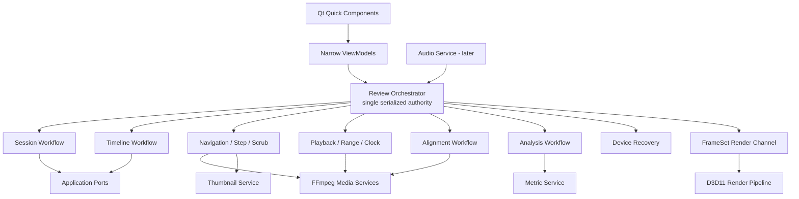

# 03｜目标架构设计

## 结论

目标架构应采用 **“单一串行会话真相 + 独立工作流 + 稳定 Source identity + 有界媒体服务 + 窄 ViewModel”**。它不是微服务化，也不是把一个 Coordinator 拆成多个互相竞态的线程；而是在保留单一提交点的前提下，将概念、状态和测试边界明确化。

推荐的目标形态：



`ReviewOrchestrator` 仍是唯一允许提交 `ReviewSnapshot`、更新 `displayedFrame` 和裁决异步事件的对象。各 Workflow 可以是内部类/纯函数/小状态机，不必各开线程。

## 1. 目标设计原则

### 1.1 Identity 不是 Slot

必须区分：

```cpp
struct SourceKey;          // 当前会话内稳定逻辑身份
struct SourceFingerprint;  // 文件跨会话身份
struct SourceSlot;         // 当前 renderer 的临时紧凑槽位
struct SourceRole;         // Reference / Candidate / Auxiliary 等业务角色
```

当前 `SourceId` 同时近似承担逻辑身份和 0..2 slot。目标中：

- SourceKey 不因排序、添加、删除、ViewMode 改变；
- Fingerprint 用于检测文件替换、缓存和结果溯源；
- Slot 只在一个 `PresentationRevision` 内有效；
- UI 不根据 Slot 推导业务语义；
- 异步任务不得只携带 Slot。

建议：

```cpp
using SourceKeyValue = std::uint64_t;

class SourceKey final {
public:
    explicit constexpr SourceKey(SourceKeyValue value);
    [[nodiscard]] constexpr SourceKeyValue value() const noexcept;
    auto operator<=>(const SourceKey&) const = default;
};

struct RenderSlotMapping final {
    PresentationRevision revision;
    std::vector<SourceKey> slotToSource;
    std::unordered_map<SourceKey, std::uint8_t> sourceToSlot;
};
```

### 1.2 Timeline、Reference、Pair、Focus 独立

```cpp
struct TimelineSelection final {
    SourceKey master;
    TimelineRevision revision;
};

struct ComparisonPair final {
    SourceKey first;
    SourceKey second;
};

struct ComparisonSelection final {
    std::optional<SourceKey> reference;
    ComparisonPair activePair;
    ComparisonDomain domain;
};

struct FocusSelection final {
    SourceKey focused;
};
```

不变量：

- timeline master 必须存在于 loaded sources；
- pair 两端必须不同且存在；
- reference 可为空；存在时也必须在 loaded sources；
- focus 必须存在；
- 删除 Source 时，所有派生选择在一个事务中归一化；
- 只有 timeline master 或 mapping 改变才增加 `TimelineRevision`；
- 只改 pair/view/metric 不增加 playback generation，不重开 provider。

### 1.3 Preferences 只保存“默认策略”

全局设置适合保存：

- 默认 ViewMode；
- 默认 Pair policy；
- 默认 playback policy；
- shortcut preset；
- OSC mode；
- UI 尺寸/布局；
- Difference 默认 metric/gain/filter。

不适合保存：

- 当前会话具体 SourceKey；
- 0/1/2 edge；
- 当前 In/Out；
- 当前 Reference 的文件身份；
- 当前 alignment result。

建议设置 schema：

```cpp
struct ComparisonDefaults final {
    ViewMode preferredMultiSourceMode;
    DefaultPairPolicy pairPolicy;
    DifferenceMetric metric;
    DifferenceGain gain;
    DifferenceFilter filter;
};

enum class DefaultPairPolicy {
    ReferenceAndMostRecentCandidate,
    FirstTwoVisibleSources,
    PreserveSessionSelection,
};
```

从旧 `differenceEdge` 迁移时，只将其转换成默认策略提示，不把 ordinal 当作可跨会话身份。

## 2. 领域模型

### 2.1 ReviewSession

```cpp
struct ReviewSource final {
    SourceKey key;
    SourceFingerprint fingerprint;
    std::filesystem::path normalizedPath;
    std::string displayName;
    std::optional<std::string> alias;
    SourceRole role;
    MediaDescriptor descriptor;
};

struct ReviewTopology final {
    SessionId sessionId;
    SessionEpoch epoch;
    TopologyRevision revision;
    std::vector<ReviewSource> sources;
    TimelineSelection timeline;
    ComparisonSelection comparison;
    FocusSelection focus;
    std::vector<SourceKey> visibleSources;
};
```

`visibleSources` 与 `sources` 分开，为未来 N 源做准备。第一阶段仍可限制 loaded/visible 为 3，但类型不再假设两者相同。

### 2.2 Canonical Timeline

```cpp
struct CanonicalTimelineState final {
    TimelineRevision revision;
    SourceKey master;
    std::shared_ptr<const FrameTimeline> timeline;
    FrameId frameCount;
    MediaTime duration;
};
```

时间线变更是重操作。命令应显式为：

```cpp
struct SetTimelineMasterCommand {
    CommandContext context;
    SourceKey master;
    PositionPreservation preservation; // MediaTime / FrameRatio / Start
};
```

UI 必须显示确认：

> 将时间线主源改为 Candidate B 会重新映射当前帧、In/Out 和对齐。Reference 不会自动改变。

### 2.3 Comparison Provenance

任何视觉或量化结果都必须带：

```cpp
enum class ComparisonDomain {
    EncodedCodeValue,
    NormalizedPlane,
    LinearLight,
    DisplayReferred
};

enum class TemporalExactness {
    ExactIndex,
    OffsetMapped,
    SequenceMapped,
    Missing
};

enum class SpatialExactness {
    ExactGeometry,
    Resampled
};

struct ComparisonProvenance final {
    SourceFingerprint first;
    SourceFingerprint second;
    TimelineRevision timelineRevision;
    AlignmentRevision alignmentRevision;
    FrameId canonicalFrame;
    std::optional<FrameId> firstSourceFrame;
    std::optional<FrameId> secondSourceFrame;
    ComparisonDomain domain;
    TemporalExactness temporal;
    SpatialExactness spatial;
    ColorTransformId colorTransform;
    ResampleFilter filter;
    std::optional<NormalizedRect> roi;
    MetricVersion version;
};
```

这使“Pixel-exact”“显示域差异”“缩放后 SSIM”不会混淆。

## 3. Application 组织

### 3.1 单一 ReviewOrchestrator

不要把现有 Coordinator 直接拆成六个独立 actor。推荐：

```cpp
class ReviewOrchestrator final : public IApplicationEventSink {
public:
    PortSubmitResult submit(ReviewCommand);
    std::shared_ptr<const ReviewSnapshot> snapshot() const;

private:
    void reduce(const ReviewCommand&);
    void reduce(const ApplicationEvent&);

    SessionWorkflow session_;
    TimelineWorkflow timeline_;
    NavigationWorkflow navigation_;
    PlaybackWorkflow playback_;
    AlignmentWorkflow alignment_;
    AnalysisWorkflow analysis_;
    DeviceWorkflow device_;

    ReviewMutableState state_;
    CoordinatorPublication publication_;
};
```

特征：

- 一个 worker/事件循环；
- 一个 mutable state；
- 所有 workflow 只能通过 orchestrator commit；
- workflow 可以生成 effects，但不能自行发布 snapshot；
- effect completion 回到同一事件入口；
- 保留 current critical/realtime ingress 思路；
- 使用纯函数验证与 transition helper，降低大 switch 的复杂度。

### 3.2 Command 分域

当前一个大 `PlaybackCommand` variant 混合会话、播放、对齐和关闭。目标：

```cpp
using ReviewCommand = std::variant<
    SessionCommand,
    TimelineCommand,
    NavigationCommand,
    PlaybackControlCommand,
    ComparisonCommand,
    AlignmentCommand,
    AnalysisCommand,
    DeviceCommand>;
```

对外仍可通过一个 `submit(ReviewCommand)`，但 admission 和 terminal 规则分域。

示例：

```cpp
using NavigationCommand = std::variant<
    SeekFrame,
    StepFrames,
    BeginScrub,
    UpdateScrub,
    CommitScrub,
    CancelScrub,
    FirstFrame,
    LastFrame>;

using PlaybackControlCommand = std::variant<
    Play,
    Pause,
    SetPlaybackRate,
    SetPlaybackPolicy,
    SetPlaybackRange>;
```

### 3.3 Exactly-once Command Terminal

统一终态注册表：

```cpp
class CommandLedger final {
public:
    bool registerCommand(CommandContext);
    bool complete(CommandId, CommandOutcome, std::optional<MediaError>);
    bool isPending(CommandId) const;
};
```

测试不变量：

- register 一次；
- complete 恰好一次；
- stale event 不完成当前命令；
- cancel、failure、closed 区分；
- shutdown 完成所有 pending；
- 不允许 command 因 frame 已 ACK 但 provider terminal 迟到而丢失。

## 4. Revision 与异步身份

现有 identity 很强，但未来功能需要细化：

```cpp
struct OperationIdentity final {
    SessionId session;
    SessionEpoch epoch;
    TopologyRevision topology;
    TimelineRevision timeline;
    AlignmentRevision alignment;
    PlaybackGeneration playback;
    DeviceGeneration device;
    RequestId request;
};
```

不同任务携带最小必要子集：

| 任务 | 必须身份 |
|---|---|
| Probe/Open | session + epoch + topology + request |
| Frame decode | session + epoch + timeline + alignment + playback + request |
| Render ACK | 上述 + device + presentation revision |
| Thumbnail | session + epoch + timeline + source fingerprint + thumbnail generation + request |
| Metric job | session + epoch + timeline + alignment + pair fingerprint + metric version + job id |
| Audio | session + epoch + timeline + playback + audio generation |
| File identity refresh | source fingerprint request generation |

规则：任何 revision 不匹配时结果只能终止自己，不能修改当前用户可见状态。

## 5. FrameSet 与 N 源扩展

### 5.1 不把 N 路全部放进实时 FrameSet

目标模型：

```cpp
struct ActivePresentationSet final {
    std::vector<SourceKey> visible; // bounded, initially <=3
    RenderSlotMapping slots;
};

struct FrameSet final {
    FrameRequestContext context;
    FrameId canonicalFrame;
    std::vector<PresentedSourceFrame> sources; // exactly visible set
};
```

逻辑会话可以有 N 路，但实时 FrameSet 只覆盖 active visible set。优点：

- 保留原子性；
- 解码成本有界；
- 选择 candidate 时可切换 visible set；
- 背景指标按批次处理其他候选；
- renderer 仍可先维持 3-slot。

### 5.2 原子切换 active set

切换候选：

1. 验证 Pair/visible selection；
2. 为新 active set 生成新的 presentation revision；
3. 若新 Source 尚未 warm，准备目标 canonical frame；
4. 组装完整新 FrameSet；
5. renderer ACK 后一次性切换；
6. 旧 FrameSet 保持可见直到新集合可用；
7. 失败则保留旧 active set。

不能先让 UI 标签切到 Candidate C，而画面仍是 Candidate B。

## 6. 媒体服务

### 6.1 Source Decode Actor

保持每源 actor，但明确四种 lane：

```text
Exact lane       1 slot  随机定位、First/Last、commit seek
Sequential lane  2 slot  正常前向播放和 +1 jog
Reverse window   1 build  有界 GOP 窗口，输出反向帧
Background lane  N bound 缩略图/分析，低优先级
```

不要让 thumbnail/metric 抢占 exact/sequential。中央 scheduler 根据：

- UI 是否正在 seek；
- playback underrun；
- GPU/CPU budget；
- memory reservation；
- task deadline

进行 admission。

### 6.2 Central Frame Budget

新增预算类别：

```cpp
enum class FrameBudgetClass {
    ForegroundExact,
    ForegroundSequential,
    ReverseWindow,
    RenderRetirement,
    Thumbnail,
    Analysis,
};
```

优先级：

```text
render retirement
> current exact
> prepared sequential
> reverse current window
> scrub preview
> thumbnail
> offline analysis
```

每个 reservation 有 owner identity 和可取消回收。全局 cache 继续遵守仓库的 256 MiB 级约束；4K/P010 时按帧大小自动缩减窗口，不使用固定“缓存 30 帧”。

## 7. Presentation 与 Renderer

### 7.1 Presentation Contract V2

旧枚举可保留兼容层，新增：

```cpp
enum class CompareMode {
    Single,
    SideBySide,
    MultiUp,
    ReferenceFocus,
    Wipe,
    Blink,
    Blend,
    Difference,
    AnalysisGrid,
    PixelInspector,
};

struct WipeOptions {
    WipeOrientation orientation; // Vertical / Horizontal / Diagonal
    float position;
    bool swapSides;
};

struct BlendOptions {
    float firstOpacity;
};

struct BlinkOptions {
    double frequencyHz;
    bool pauseWhenWindowInactive;
};

struct DifferenceOptions {
    DifferenceMetric metric;
    DifferenceGain gain;
    DifferenceFilter filter;
    ThresholdOptions threshold;
    ComparisonDomain domain;
};
```

Pair 使用 SourceKey，在进入 renderer 前转换成两个 slots。

### 7.2 Render Pass 化

不建议重写 D3D11 renderer，但应渐进拆分：

```text
Acquire FrameSet
  → Validate resources/identity
  → Normalize source views
  → Color transform
  → View transform / ROI
  → Layout pass
  → Comparison pass
  → Overlay/passive diagnostics
  → Present + ACK
```

每个 pass 的 CPU 配置是纯值类型，GPU resources 由 renderer 管理。量化指标不得同步读取 render target；需要异步 compute/readback ring 或独立分析路径。

### 7.3 ACK 语义

ACK 必须包含：

```cpp
struct PresentationAck {
    FrameRequestContext frame;
    PresentationRevision presentation;
    DeviceGeneration device;
    RenderOutcome outcome;
};
```

仅当 frame/presentation/device 均匹配时可提交。纯 ViewMode 变更若重绘 retained frame，也应有独立 presentation revision，不能误推进 displayedFrame。

## 8. 窄 ViewModel

目标 façade：

```cpp
Q_PROPERTY(SessionViewModel* session ...)
Q_PROPERTY(PlaybackViewModel* playback ...)
Q_PROPERTY(TimelineViewModel* timeline ...)
Q_PROPERTY(ComparisonViewModel* comparison ...)
Q_PROPERTY(AlignmentViewModel* alignment ...)
Q_PROPERTY(DiagnosticsViewModel* diagnostics ...)
Q_PROPERTY(ShellViewModel* shell ...)
```

### 8.1 高频与低频隔离

- Playback：playing、framePending、displayed frame/time、rate、policy、capability；
- Timeline：count、progress、zoom window、In/Out、markers、thumbnail；
- Comparison：sources、reference、active pair、view、exactness、metric；
- Diagnostics：operation、decoder backend、drop count、errors；
- Session：source identities、aliases、topology intent；
- Alignment：offset/map/job/proposal；
- Shell：chrome、inspector、dialogs、focus context。

高频 `displayedFrame` 变化不应触发 Source metadata、compatibility findings 或 alignment proposal 的 property notify。

### 8.2 QML 只做布局与瞬时手势

允许 QML 拥有：

- hover；
- drag visual；
- transient popup；
- animation；
- local focus；
- 未提交的 slider position。

不允许 QML 拥有：

- playback clock；
- Range Loop；
- async operation terminal；
- source topology transaction；
- active Pair validity；
- decoder retry；
- metric job truth。

## 9. 错误与诊断模型

当前字符串应转为 typed event：

```cpp
enum class DiagnosticPriority {
    Fatal,
    RecoverableAction,
    ActiveOperation,
    Correctness,
    Performance,
    PassiveInfo
};

struct DiagnosticItem {
    DiagnosticCode code;
    DiagnosticPriority priority;
    MessageKey userMessage;
    std::string technicalDetail;
    std::vector<RecoveryAction> actions;
    OperationIdentity identity;
};
```

UI status rail 决定显示优先级；技术详情放可展开面板。错误恢复 action 可以是：

- Retry software decode；
- Reload changed file；
- Remove failed source；
- Keep current session；
- Reset alignment；
- Rebuild graphics device。

## 10. Persistence 与 Workspace

近期继续保持 session-only 是合理的。但 architecture 要为未来 workspace 留边界：

```cpp
struct ReviewWorkspaceV1 {
    std::vector<SourceFingerprintRef> sources;
    std::optional<SourceFingerprint> timelineMaster;
    std::optional<SourceFingerprint> reference;
    std::optional<FingerprintPair> activePair;
    std::vector<Marker>;
    std::optional<MediaTimeRange> range;
    PresentationPreferences presentation;
};
```

规则：

- workspace 是外层 adapter；
- 加载必须先解析成 `OpenReviewIntent`；
- 文件变化需要用户确认；
- 不把旧 renderer slot 持久化；
- metric result 可以显式导出，不偷偷写入全局 settings。

当前里程碑不必实现 workspace，但新的 Source identity 不能阻断它。

## 11. 迁移策略

### 11.1 Branch by Abstraction

1. 新类型与新 snapshot 先加入，不改行为；
2. 旧 `SourceId/edge` 通过 adapter 映射；
3. 新 ComparisonViewModel 使用 V2；
4. QML 切换到新 model；
5. 旧 property 标记 deprecated；
6. 测试与调用全部迁移后删除；
7. 每一步可独立发布。

### 11.2 Feature Flag 仅用于短期验证

可临时使用：

- `comparison_selection_v2`
- `native_range_loop`
- `reverse_step_window`
- `thumbnail_provider_v2`

但 flag 必须有删除任务和截止里程碑，不能形成永久双实现。

### 11.3 不做 Big Bang Rewrite

禁止在一个 PR 同时：

- 改 Domain identity；
- 拆 Coordinator；
- 改 renderer slot；
- 扩 N source；
- 加 metrics；
- 重做 UI。

正确顺序是先建类型和 contract tests，再逐层替换。

## 12. 目标架构完成判据

- `Reference` 改变不重建 timeline；
- `ActivePair` 改变不递增 playback generation；
- QML 不含 Range Loop 或 media terminal 状态机；
- façade 的六个 capability 不再指向同一 controller；
- `Main.qml` 主要负责 composition/layout，业务字符串和选择归一化离开 QML；
- loaded source 与 render slot 类型分离；
- reverse/scrub/thumbnail/analysis 都有有界资源与 identity；
- renderer 接收已验证的 active pair slots，不自行猜测；
- 每个 metric/visual result 有 provenance；
- 现有 FrameSet/ACK/rollback 不变量全部保留。
